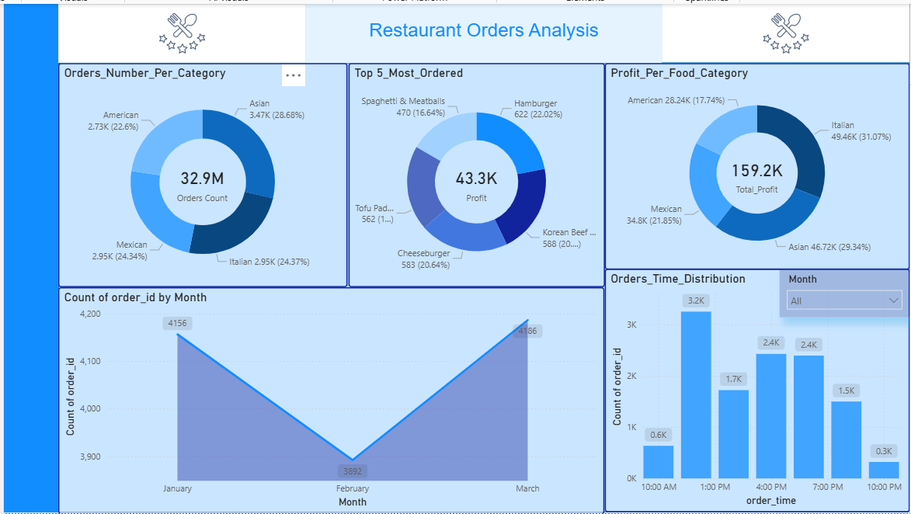

# 🍽️ Restaurant Orders Analysis - Power BI Dashboard

This repository contains a **Power BI Dashboard** analyzing restaurant orders, profits, and customer behavior. It provides insights into **food categories, order distribution, profit contribution, and time-based ordering patterns**, helping restaurants make data-driven decisions.

---

## 📂 Repository Structure

```
Restaurant_Orders_Analysis/
├── Restaurant_Orders_Analysis.pbix   # Power BI dashboard file
├── Restaurant_Orders_Analysis.PNG    # Dashboard preview
└── README.md                         # Project documentation
```

---

## 📸 Dashboard Preview



---

## ⚙️ Features of the Dashboard

- **Orders by Category**  
  - Breakdown of total orders across **Asian, Italian, Mexican, and American cuisines**.  

- **Top 5 Most Ordered Items**  
  - Identifies high-demand menu items such as **Hamburgers, Korean Beef, Cheeseburgers, and Spaghetti & Meatballs**.  

- **Profit by Food Category**  
  - Highlights profit contribution of each cuisine category.  
  - Italian (31.07%) and Asian (29.34%) generate the highest profits.  

- **Monthly Trends**  
  - Order volume analyzed by **month** (January–March).  
  - March shows a recovery after a dip in February.  

- **Time-Based Order Distribution**  
  - Orders tracked by time of day.  
  - Peak hours: **1:00 PM** (~3.2K orders) and **4:00 PM – 5:00 PM** (~2.4K orders each).  

---

## 📊 Key Insights

1. **Cuisine Popularity**
   - Asian cuisine has the highest order count (3.47K, 28.68%).  
   - Italian and Mexican also perform strongly, while American lags behind.  

2. **Profitability**
   - Italian cuisine drives the most profit (49.46K, 31%).  
   - Asian cuisine follows closely (46.72K, 29%).  
   - Mexican contributes less (34.8K, 21.8%).  

3. **Menu Performance**
   - Hamburgers and Korean Beef are the most popular single items.  
   - Opportunity: Promote underperforming items (like Tofu Pad Thai).  

4. **Seasonality**
   - Orders dipped in February (3.89K) but rose again in March (4.18K).  

5. **Customer Behavior**
   - Lunch (1 PM) and evening (4–5 PM) are peak ordering times.  
   - Low activity after 9 PM.  

---

## 🧮 Example DAX Measures

```DAX
-- Total Orders
Total_Orders = COUNTROWS(Orders)

-- Total Profit
Total_Profit = SUM(Orders[Profit])

-- Orders by Category %
Orders_Per_Category = 
DIVIDE(
    COUNTROWS(Orders),
    CALCULATE(COUNTROWS(Orders), ALL(Orders[Category]))
)

-- Monthly Orders
Orders_By_Month = COUNTROWS(Orders)

-- Profit Contribution %
Profit_Per_Category = 
DIVIDE(
    SUM(Orders[Profit]),
    CALCULATE(SUM(Orders[Profit]), ALL(Orders[Category]))
)
```

---

## 🚀 How to Use

1. Clone this repository:
   ```bash
   git clone https://github.com/YourUsername/Restaurant_Orders_Analysis.git
   cd Restaurant_Orders_Analysis
   ```

2. Open the `.pbix` file in **Power BI Desktop**.  
3. Interact with filters and slicers to explore insights.  

---

## 📦 Tools Used

- **Microsoft Power BI Desktop**  
- **DAX (Data Analysis Expressions)** for custom measures  
- **Power Query** for ETL (data cleaning and transformation)  

---

## ✨ Future Enhancements

- Add **Forecasting visuals** to predict next month’s orders.  
- Segment customers by **age group, region, and order frequency**.  
- Include **delivery performance metrics** (on-time vs delayed).  
